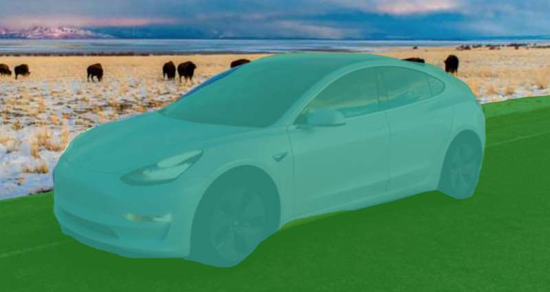

 
### Need to label images to train a neural network?

This post will describe how to design a system for labeling objects on an image by a human.

**Note: this post is about manual step, when we need to highlight objects BEFORE training a neural network.**

I will show you how to use [React](https://reactjs.org/), 2d canvas and [Konva](https://konvajs.org/) framework to make an app that allows you to highlight objects. Also, I will cover some edge cases specific to that task.

_[Open demo](https://codesandbox.io/embed/github/konvajs/site/tree/master/react-demos/image-label-tool). Looking for help with a similar application? [Contact me](/consulting)._

That prototype was built special for [Labelbox](https://labelbox.com/).


## The idea

In many areas of machine learning and AI we need to label images with objects to train the system. The action should be done by a human (who already know how to detect and label images, right?). So the human needs to draw something like "where is the tree here?", "where is the house here?" etc.


So at first, the task is trivial. We need to make a system that allows us to see objects and draw some shapes on top of it with the free drawing:


So it is just a canvas with an image in it and a set of lines, that we can create with mouse events:


```javascript
<Stage
  onMouseDown={startDrawing}
  onMouseMove={addNewPoints}
  onMouseUp={finishDrawing}
>
  <BaseImage />
  <Regions regions={createdLines} />
</Stage>
```

## Requirement - transparent, non-overlapping regions

To make the basic image visible, we need to make our regions transparent, so even after some drawing, you see the whole image. With the `Konva` and 2d canvas API, it is simple, we can just set alpha channel with `opacity` attribute:

```javascript
<Line
  points={region.points}
  fill={region.color}
  opacity={0.7}
  closed
/>
```

That works just fine. You will see the underlying image. But it produces another issue, we can have overlapping regions:


In that case, we have overlapping road and car annotations. By the requirements of machine learning algorithms, such situations are not acceptable. Every pixel of an image should represent a color of particular annotation. In the case of overlapping objects, we have mixed colors. How to resolve the issue?

### Solution 1 - use transparent layer

In `Konva` we can have several layers. Each layer has its own `<canvas>` element. We can style that canvas element manually with CSS. We will not use canvas API to set opacity, but instead, we will make the canvas transparent:

```javascript
const Regions = ({ regions }) => {
  const layerRef = React.useRef(null);

  React.useEffect(() => {
    // find canvas element
    // warn: to use private API of Konva
    const canvas = layerRef.current.getCanvas()._canvas;
    // set opacity manually:
    canvas.style.opacity = 0.8;
  });

  return (
    <Layer ref={layerRef}>
      {regions.map(region => {
        return (
          <Line
            points={region.points}
            fill={region.color}
            closed
          />
        );
      })}
    </Layer>
  );
};
```

Now a region is not transparent when we are drawing it into the canvas element. But the canvas element itself is transparent, so the regions look like transparent. We don't have the "overlapping sections" issues:



That solves the problem. But later in time, we have another requirement, we need the ability to "select" a region. When a region is selected it should have no transparency (or very tiny). But we can't do that with the current approach. Why? Good question. Because when we set opacity with CSS we are setting a maximum opacity for all regions. How to fix it?

### Solution 2 - cut regions from each other

The idea is simple. Let think that we have two overlapping regions A and B. First we are drawing the region A on canvas. Then we are erasing a part that overlaps with B. Then we draw the region B. Thanks to [globalCompositeOperation](https://developer.mozilla.org/en-US/docs/Web/API/CanvasRenderingContext2D/globalCompositeOperation) from 2d canvas API, we can easily do it:

```javascript
const Regions = ({ regions, selectedId }) => {
  return (
    <Layer>
      {regions.map(region => {
        const isSelected = region.id === selectedId;
        return (
          <React.Fragment>
            {/* first we need to erase previous drawings */}
            {/* we can do it with  destination-out blend mode */}
            <Line
              globalCompositeOperation="destination-out"
              points={region.points}
              fill="black"
              closed
            />
            {/* then we just draw new region */}
            <Line
              points={region.points}
              fill={region.color}
              closed
              opacity={isSelected ? 1 : 0.8}
            />
          </React.Fragment>
        );
      })}
    </Layer>
  );
};
```

In this example I selected the giraffe. It is not transparent. Two zebras are transparent and they have overlapping regions, but we don't see them, because we used a "cut" method:


## Changing the brightness of the image

Sometimes images are too light or too dark. So we need the ability to change their brightness. We can easily do that with [Brighten filter](https://konvajs.org/docs/filters/Brighten.html) from `Konva` framework:

```javascript
const BaseImage = ({ brightness }) => {
  const [image] = useImage(IMAGE_URL, "Anonymous");

  const imageRef = React.useRef(null);

  React.useEffect(() => {
    if (!image) {
      return;
    }
    // we need to cache image in order to use filters
    imageRef.current.cache();
  }, [image]);

  return (
    <Layer>
      <Image
        image={image}
        ref={imageRef}
        filters={[Konva.Filters.Brighten]}
        brightness={brightness}
      />
    </Layer>
  );
};
```

And that approach works well for many cases.


But sometimes images are HUGE. They have a lot of pixels. `Konva` filters work by manipulating every pixel with JavaScript, it works on CPU level. But we can use the power of CSS filters. In many browsers (probably all) CSS filters work on GPU level. So it can be much faster:


```javascript
const BaseImage = ({ brightness }) => {
  const [image] = useImage(IMAGE_URL, "Anonymous");

 const layerRef = React.useRef(null);

  React.useEffect(() => {
    const canvas = layerRef.current.getCanvas()._canvas;
    // apply css filters manully
    canvas.style.filter = `brightness(${(brightness + 1) * 100}%)`;
  }, [brightness]);

  return (
    <Layer ref={layerRef}>
      <Image
        image={image}
      />
    </Layer>
  );
};
```

That approach works MUCH faster, even for very large images.

## The result

After some polishing, implementing better navigation, showing the list of current labels we have a working prototype.
The real client's app is working a bit differently because it has some other extra features, but it was important to make a proof-of-concept to make sure that selected technologies will do the work.

With that system we can easily export mask images into machine learning algorithms.

Here is the full demo (or open it in [a new tab](https://codesandbox.io/embed/github/konvajs/site/tree/master/react-demos/image-label-tool)):


<iframe src="https://codesandbox.io/embed/github/konvajs/site/tree/master/react-demos/image-label-tool?hidenavigation=1&view=preview&fontsize=10" style="width:100%; height:500px; border:0; border-radius: 4px; overflow:hidden;" sandbox="allow-modals allow-forms allow-popups allow-scripts allow-same-origin"></iframe>


--- 

Looking for help with a similar application? [Contact me](/consulting).