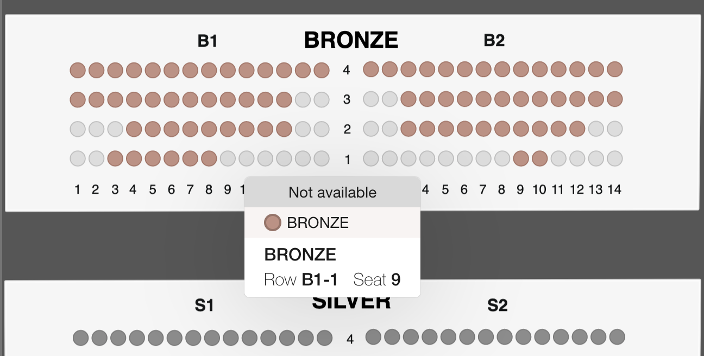
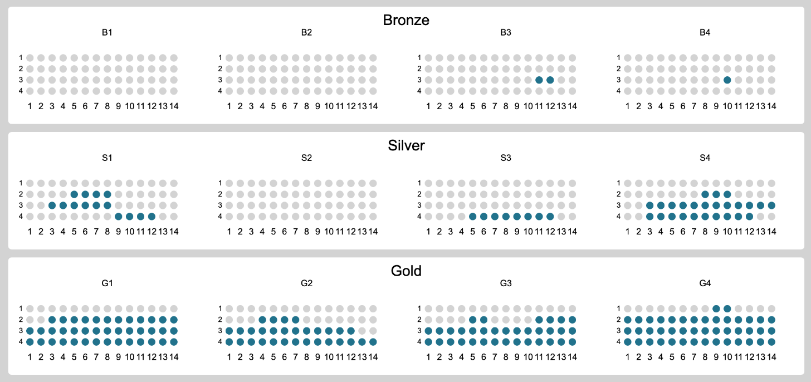

### Do you want to make a seat booking platform on your website?

This post will describe steps to design a seat reservation system for music festival website made with JavaScript.

It will show how to use [React](https://reactjs.org/), 2d canvas and [Konva](https://konvajs.org/) framework to make high-performance widget.

_[Open demo](https://codesandbox.io/embed/github/konvajs/site/tree/master/react-demos/seats-reservation). Looking for help with a similar application? [Contact me](/consulting)._


## The idea

The client need the ability to reserve and book seats to the music festival directly on the website. It is important to see available sections, seats and their prices.

For a while the client was using [https://www.seats.io/](https://www.seats.io/) to render seats chart and to allow selecting and booking. But as prices were coming up and there were some issues with backend integration and making sure that there is no double booking, the client decided to make its own solution to inject into the main website.

So the task was to create a similar solution with some simplifications that allow to draw charts like seats.io:



There is no business value in fancy animations, cool graphics, etc. I need to make a fast and simple tool for reservations.

## Bootstrapping

As the client is already using [React](https://reactjs.org/) for the main application I should allow simple API and make a React component, so it is simple to use it in the workflow of the current codebase.

When you are making a chart or some data visualizations there are tons of available options and approaches.

You can create a chart with regular DOM (a bunch of `divs`), SVG element, 2d canvas or WebGL.  As the client comes to me from the [Konva](https://konvajs.org/) website he already decided to make it with 2d canvas. But before jumping to consulting I was thinking about other approaches.

WebGL can be an overkill for the solution because it may be too low-level and requires implementation that hard to make in a short time and make it simple.

Bunch of `divs` and `spans` and SVG drawings are very similar DOM-based solutions. The chart with seats may have A LOT of elements, like some shapes for seats, text labels for rows, columns and sections, etc. So it may produce a lot of DOM elements. They can slow down the performance of the application.

2d canvas solution doesn't need many DOM elements (it need just a canvas) so it can lead to a better performance comparing to SVG solution. Also if you are using `Konva` framework you already have some built-in functions that can help you bootstrap the application faster, like drag&drop, drag boundaries limits, caching to boost the performance (more on this later). `react-konva` npm package will allow us to make a React component.

## Building the architecture

The chart structure will be loaded from the backend. The JSON has full information about available sections, seats, prices, etc.

The chart building starts from the data loading and making an initial layout for the chart:

```javascript
const useFetch = url => {
  const [data, setData] = React.useState(null);
  React.useEffect(() => {
    fetch(url)
      .then(res => res.json())
      .then(data => setData(data));
  }, [url]);
  return data;
};

const MainStage = props => {
  const jsonData = useFetch("./seats-data.json");
  const width = 1000;
  const height = 1000;

  if (jsonData === null) {
    return <div>Loading...</div>;
  }
  
  return (
    <Stage width={width} height={height}>
      <Layer>
        {sections.map(item => {
          return <Section section={item} />
          })}
      </Layer>
    </Stage>
  )
}
```

## Layout

The structure of the chart is simple. A concert hall consists of several sections (with different prices), each section has its own subsections and each subsection has many seats.

Now we need to decide how we will layout the chart and how we will set positions of all internal components.

There are two main approaches:

1. **From top to bottom**. When a parent container decides its own size and passes size to child components down to the tree.
2. **From bottom to top**. When a child component defines its own size manually and then the parent element adopts its own size and positions of children elements.

When you are building the web application with CSS you can use any of those methods or even combine them.

In general **from bottom to top** approach should work better, because the parent container doesn't need to know full information about children elements and their sizes to define layout. But with `Konva` you can't use that method directly because you have to set all positions of all elements manually. Let me show the issue:

```javascript
<Stage width={width} height={height}>
  <Layer>
    {sections.map(item => {
      // we need to set position of each section
      // but if the height of each section is differrnt
      // and defined inside a Section component
      // how we will move set positions?
      return <Section y={??} section={item} />
    })}
  </Layer>
</Stage>
```

As I solution I decided to create a special file `layout.js` where I can define all the constants and the functions to calculate the size of any element:

```javascript
export const SEAT_SIZE = 10;
export const SEATS_DISTANCE = 15;
export const SUBSECTION_PADDING = 30;

export const SECTION_TOP_PADDING = 40;

export const getSubsectionHeight = subsection => {
  const rows = Object.keys(subsection.seats_by_rows);
  return SEATS_DISTANCE * rows.length + SUBSECTION_PADDING * 2;
};

export const getSectionHeight = section => {
  return (
    Math.max(...section.subsections.map(getSubsectionHeight)) +
    SECTION_TOP_PADDING
  );
};
```

That file will work as CSS definition for the whole chart layout. It is a single place where all constants are defined, so we don't mess the rendering.

So sections drawing can look like this:

```javascript
// where was the last section?
let lastSectionPosition = 0;

<Stage width={width} height={height}>
  <Layer>
    {sections.map(item => {
      const height = layout.getSectionHeight(section);
      const position = lastSectionPosition + layout.SECTIONS_PADDING;
      lastSectionPosition = position + height;
      return <Section y={position} section={item} />
    })}
  </Layer>
</Stage>
```

## Zooming

The chart can be large, if you are using it on the desktop,  you can draw it as is, because you have plenty of space to make everything visible. But on mobile things become different.

We need to find a way to zoom out the whole chart to make it fully visible and zoom in to make it possible to interact with the particular seats.

Until the full chart is loading we don't know what will be its size. We don't know the number of seats, subsections, etc.

But, right after the chart is loaded and the rendering is finished, we can take and access to `Konva` nodes to calculate the size of the rendered chart and calculated required zoom:

```javascript
const width = 1000;
const [scale, setScale] = React.useState(1);
const [scaleToFit, setScaleToFit] = React.useState(1);

React.useEffect(() => {
  if (!stageRef.current) {
    return;
  }
  const stage = stageRef.current;
  // client rect will return bounding box of the stage
  // it means the size of area, required to draw all the children
  const clientRect = stage.getClientRect();

  const scaleToFit = width / clientRect.width;
  setScale(scaleToFit);
  setScaleToFit(scaleToFit);
}, []);

return <Stage width={width} height={height} scaleX={scale} scaleY={scale}>;
```

As we know the scale required to fit everything into the screen, we can use it to easily toggle zoom on double tap or double click:

```javascript
const toggleScale = React.useCallback(() => {
  if (scale === 1) {
    setScale(scaleToFit);
  } else {
    setScale(1);
  }
}, [scale, scaleToFit]);
```

## Drawing the chart

The actual rendering of the chart is very straightforward. We are just using `<Group>` to organize sections, drawing background for each section as a rectangle and seats as circles.

As the result of initial drawing I have this:



## Performance

After making the initial implementation of all basic functions I need to check how the app works in term of the performance.

One of the cool side of 2d canvas and `Konva` frameworks is the ability to cache any node (like a shape or a group) into an image. So the browser doesn't need to redraw every node on an update. Because it can just draw a cached bitmap image. It is much faster for many cases.

In this app I used a caching for sections:

```javascript
const Section = ({x ,y}) => {
  const containerRef = React.useRef();
  React.useEffect(() => {
    // recache group on any update
    containerRef.current.cache();
    // manually update Konva layer with the last updates
    containerRef.current.getLayer().batchDraw();
  });
  return (
    <Group y={y} x={x} ref={containerRef}>
      {/* internal components of the section */}
    </Group>
  );
}
```

When I tried to emulate low-level device on my MacBook the performance for drag&drop increased a lot from 5-10 fps to 50-60 fps!

Another way to improve the widget is to make it as small as possible in terms of dependencies. There is no sense to remove React from the solution because it is already used in the main client's application. We can remove `Konva` dependency and draw everything with SVG, but it can drop realtime performance

> The bad SVG performance is just a guess and may not be true. For large apps, it is better to make a prototype with all possible approaches and see which one works better.

The next step will is to make `react-konva` dependency as small as possible. But default `Konva` codebase is large, it has many shapes, filters, etc. In our case we don't need all of these, accept some shapes. To make it smaller we can do this:

```javascript
// instead of:
// import { Stage, Layer, Rect } from "react-konva";

// we will load minimal version of 'react-konva`
// minimal version has NO support for core shapes and filters
// if you want import a shape into Konva namespace you can just do this:
import "konva/lib/shapes/Rect";
import "konva/lib/shapes/Circle";
import "konva/lib/shapes/Text";

// load minimal version of 'react-konva`
export {
  Stage,
  Layer,
  Group,
  Rect,
  Circle,
  Text
} from "react-konva/lib/ReactKonvaCore";
```

## The result

At the end of the work, we have a fast and easy to use widget that works on mobile and desktop browsers.

You can try here (or open in [a new tab](https://codesandbox.io/embed/github/konvajs/site/tree/master/react-demos/seats-reservation)):

<iframe src="https://codesandbox.io/embed/github/konvajs/site/tree/master/react-demos/seats-reservation?hidenavigation=1&view=split&fontsize=10" style="width:100%; height:500px; border:0; border-radius: 4px; overflow:hidden;" sandbox="allow-modals allow-forms allow-popups allow-scripts allow-same-origin"></iframe>

--- 

Looking for help with a similar application? [Contact me](/consulting).