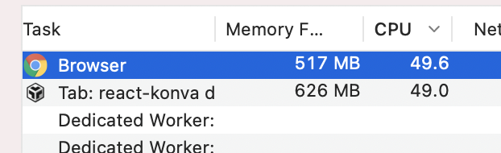
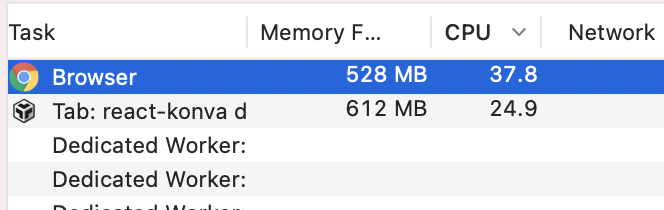

The post describes steps to build a video editor prototype for organizing video streaming from the browser.

## The idea

Do you know that you can create a video stream from the browser? Thanks to [captureStream](https://developer.mozilla.org/en-US/docs/Web/API/HTMLMediaElement/captureStream) API we can generate a video stream from the canvas element and send it to the backend (and later send to other users). And we can draw anything on that canvas!

I am going to describe key points to make such an editor.

_[Open final demo](https://codesandbox.io/embed/github/lavrton/lavrton.github.io/tree/source/demos/stream-editor-with-polotno). Looking for help with a similar application? [Contact me](/consulting)._

## How to start screen and video recording?

We will need two main API here: [getUserMedia](https://developer.mozilla.org/en-US/docs/Web/API/MediaDevices/getUserMedia) and [getDisplayMedia](https://developer.mozilla.org/en-US/docs/Web/API/MediaDevices/getDisplayMedia).

```js
var constraints = { video: true, audio: false };
let userPromise;
function getUserMedia() {
  if (!userPromise) {
    userPromise = navigator.mediaDevices.getUserMedia(constraints).catch(function (err) {
      console.log(err.name + ': ' + err.message);
    }); // always check for errors at the end.
  }
  return userPromise;
}

let displayPromise;
function getDisplayMedia() {
  if (!displayPromise) {
    displayPromise = navigator.mediaDevices.getDisplayMedia(constraints).catch(function (err) {
      console.log(err.name + ': ' + err.message);
    }); // always check for errors at the end.
  }
  return displayPromise;
}
```

Also I am going to use `React` to display video on the screen. Using functions above we can write simple hooks:

```js
export const useUserStream = () => {
  const [stream, setStream] = React.useState(null);

  React.useEffect(() => {
    getUserMedia().then(function (mediaStream) {
      setStream(mediaStream);
    });
  }, []);

  return stream;
};

export const useDisplayStream = () => {
  const [stream, setStream] = React.useState(null);

  React.useEffect(() => {
    getDisplayMedia().then(function (mediaStream) {
      setStream(mediaStream);
    });
  }, []);

  return stream;
};
```

## How to display video on the canvas?

I am going to use `React` and [Konva framework](https://konvajs.org/) to build a canvas application. Following [Konva Video Tutorial](https://konvajs.org/docs/sandbox/Video_On_Canvas.html) I am going to write a react component to draw a video on a canvas:

```js
// react hook to create a video DOM element from getUserMedia or getDisplayMedia stream
const useVideo = (stream) => {
  const video = React.useMemo(() => {
    return document.createElement('video');
  }, [stream]);

  React.useEffect(() => {
    if (!stream) {
      return;
    }
    video.srcObject = stream;
    video.onloadedmetadata = function (e) {
      video.play();
    };
  }, [stream]);
  return video;
};

const Video = ({ element }) => {
  const stream = element.type === 'user-video' ? useUserStream() : useDisplayStream();
  const video = useVideo(stream);

  const shapeRef = React.useRef();

  React.useEffect(() => {
    const anim = new Konva.Animation(() => {
      // do nothing in animation, it will just automatically redraw a layer
    }, [shapeRef.current.getLayer()]);
    anim.start();
    return () => anim.stop();
  }, [video]);

  return (
    <Image
      elementId={element.id}
      ref={shapeRef}
      draggable
      image={video}
      width={element.width}
      height={element.height}
      x={element.x}
      y={element.y}
      rotation={element.rotation}
    />
  );
};
```

To make the final demo I am going to use https://polotno.dev/ framework. It already has support for [Drag&drop Feature](https://konvajs.org/docs/drag_and_drop/Drag_and_Drop.html) and [Transforming ability](https://konvajs.org/docs/react/Transformer.html) from the `Konva`.

## How to capture canvas?

In Konva framework we have a node structure like this:

```
- Stage
 - Layer
  - Shapes
```

`Stage` represents just a `div` wrapper. And `Layer` is an actual canvas element on the screen.
Using we can access canvas element in order to create a stream from it:

```js
const App = () => {
  const layerRef = React.useRef();
  React.useEffect(() => {
    // on mount
    const layerNode = layerRef.current;
    // get canvas element from the layer
    const canvasElement = layer.getCanvas()._canvas;
    // create a stream from the canvas
    var stream = canvasElement.captureStream(25);
  }, []);
};
```

## How to optimize the performance?

While making an application I noticed that it consume a lot of CPU. Yeah, video processing is expensive. But can we do anything to improve the performance?
On my machine that app doesn't work slow. It is faster. But hight CPU usage means high energy consumption (fast battery drain and hot temperature in my room).

That is CPU level before any optimizations:



The main reason is in video rendering on the canvas and animation hook:

```js
React.useEffect(() => {
  const anim = new Konva.Animation(() => {
    // do nothing in animation, it will just automatically redraw a layer
  }, [shapeRef.current.getLayer()]);
  anim.start();
  return () => anim.stop();
}, [video]);
```

`Konva.Animation` is working with `requestAnimationFrame` it means it is trying to draw frames as fast as possible. Ideally, it is about 60 FPS. But do we need that large FPS for streaming? Probably your screen/webcam has lower FPS. Also a sending a stream into the backend with 60 FPS doesn't make much sense. What if 30 FPS can do the work? What if a user on low-end device and he wants to reduce CPU usage even more with a lower stream quality?

In that case I am going to control FPS manually with different `quality` option:

```js
// let's think we can have three levels of quality:
const INTERVALS = {
  high: 1000 / 50,
  good: 1000 / 30,
  low: 1000 / 5,
};

React.useEffect(() => {
  const interval = setInterval(() => {
    shapeRef.current.getLayer().batchDraw();
  }, INTERVALS[quality]);
  return () => clearInterval(interval);
}, [quality, video]);
```

CPU usage on my computer on a lower quality:



## The result

<iframe src="https://codesandbox.io/embed/github/lavrton/lavrton.github.io/tree/source/demos/stream-editor-with-polotno?hidenavigation=1&view=preview&fontsize=10" style="width:100%; height:500px; border:0; border-radius: 4px; overflow:hidden;" sandbox="allow-modals allow-forms allow-popups allow-scripts allow-same-origin"></iframe>

---

Looking for help with a similar application? [Contact me](/consulting).
