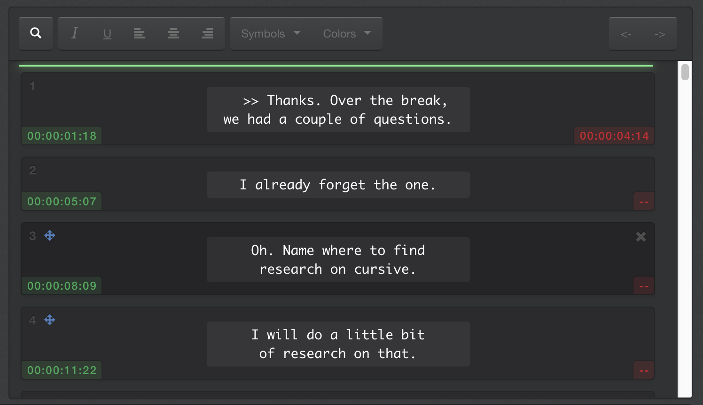

From 1.5 sec to 50–100ms (per update)

There is my short story about how I improved performance of the web-app by 10x with just a simple trick.

I was building web-based application for a client. It was captions (subtitles) review tool for videos. So you have a video, you have list of subtitles and you want to edit them.

One day I have loaded large projects into the app. The project had several hundreds of captions. The app was not fast, but it was working good enough. Until I click “delete” button of the first caption. I noticed that this operation was VERY slow. It took about **1.5** sec for deleting. This glitch was very noticeable. Why was it slow? After some investigation, I found that React has to rerender ALL captions on delete. You may ask why, if it is just deleting? The thing is — each caption should show its index (see in top left). So when you delete the first caption, indexes of all other captions need to be updated.

As a proof I deleted the last element, it was very fast. It may still look strange why updating of indexes is slow. Even if react didn’t need to touch a lot of elements (pfuuu, just several hundreds), it needs to do a LOT of work under the hood. It needs to call render for each element, it needs to create a new tree of virtual DOM and it needs to calculate changes and it needs to apply them. This operation tooks long time because one caption component has many elements inside.

I started to think to use [react-virtualized](https://github.com/bvaughn/react-virtualized) for hiding invisible captions. This should 100% solve the issue. But, the app has some features about scrolling list in several conditions. To calculate correct scrolling position I needed all elements to be in the DOM (otherwise calculation is too complex). As I have some legacy code, this change may take too long time to implement and test and it may break the app in some cases.

So I continued to think about a faster solution. In that project, I was using [mobx](https://mobx.js.org/) for state management. The cool thing about it is observable values and ability to create React components that OBSERVE changes. So I thought: I need to update item element but how to update index directly without calling render of the whole caption?

This is how part for render function was looking before changes:

[mobx-react](https://github.com/mobxjs/mobx-react) automatically track usage of properties in render function. “index” property changed — component updated.

But here is quick and simple fix. Let us create special component for displaying JUST index:

And then we will use this component inside render of whole item:

What did it change? In this case I am not using “index” property directly inside item render. So when I updated the index this component is not updated (it doesn’t observe that changes). BUT child component will be updated (directly and very fast), because it listens to changes of “index” property.

Notice that this approach **will not work**, if you will use index directly here, like `<IndexTest index={segment.index}/>`

Performance improved A LOT with this simple refactoring.

Every time you want to fix performance of a web-app remember to be smart and measure the performance. In my case one item element has many properties (index, text, start time, end time and many other). And I didn’t move rendering of all of these properties into separate components. It just make no sense.

> Question: what is the best way to apply something similar if you are using pure setState or redux architecture? I didn’t have anything beautiful in mind, do you?

Looking of help with react performance? [Send me a message](/consulting/web-perf.html).

