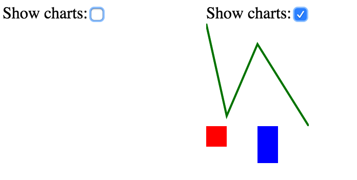
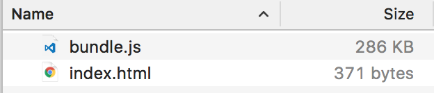
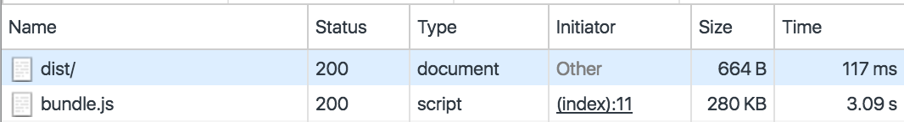
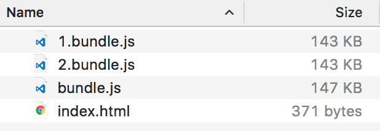
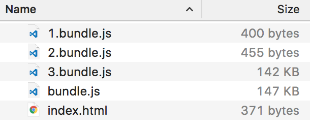

# Progressive loading for modern web applications via code splitting

Are your users tired of waiting when your app is loading and they close the tab? Let’s fix it with the progressive loading!

I will use __webpack__ for bundling and React for a demonstration.

I am compiling and bundling all my javascript files (sometimes css and images too) into ONE HUGE bundle.js. I guess you are doing this too, aren’t you? It is a pretty common approach for making modern web applications.

But this approach has one (sometimes very important) drawback: first loading of your app may take too much time. As a web browser have to (1) load large file and (2) parse a lot of javascript code. And loading can take really much time if a user has bad internet connection. Also, your bundled file can have components that user will never see (e.g. user will never open some parts of your application).

## Progressive Web Apps?

One of the good solutions for better UX is Progressive Web App. Google this term if you don’t know it yet. There are tons of good posts and videos about it. So Progressive Web has several core ideas, but right now I want to focus on Progressive Loading and implement it .

The idea of Progressive Loading is very simple:

1. Make “initial load” as fast as possible.
2. Load UI components only when they are required.

Let us assume we have React Application that draws some charts on a page:

```javascript
import React from 'react';

import LineChart from './LineChart';
import BarChart from './BarChart';

export default class App extends React.Component {
    // do not show charts on first loading
    state = {
        showCharts: false
    };

    // toggle charts
    handleChange = () => {
        this.setState({
            showCharts: !this.state.showCharts
        });
    }

    render() {
        return (
            <div>
                Show charts:
                <input
                  type="checkbox"
                  value={this.state.showCharts}
                  onChange={this.handleChange}
                />

                {
                    this.state.showCharts ?
                    <div><LineChart/><BarChart/></div>
                    : null
                }
            </div>
        );
    }
}
```

Chart components are very simple:

```javascript
// LineChart.js
import React from 'react';
import {Stage, Layer, Line} from 'react-konva';

export default () => (
    <Stage width={100} height={100}>
        <Layer>
            <Line stroke="green" points={[0, 0, 20, 90, 50, 20, 100, 100]}/>
        </Layer>
    </Stage>
);
```


```javascript
// BarChart.js
import React from 'react';
import {Stage, Layer, Rect} from 'react-konva';

export default () => (
    <Stage width={100} height={100}>
        <Layer>
            <Rect fill="red" width={20} height={20}/>
            <Rect fill="blue" x={50} width={20} height={60}/>
        </Layer>
    </Stage>
);
```


These charts can be very heavy. Both of them have [react-konva](https://github.com/lavrton/react-konva) as a dependency (and [konva](https://konvajs.github.io/) framework as a dependency of [react-konva](https://github.com/lavrton/react-konva)).

Please note that `LineChart` and `BarChart` are not visible on the first load. To see them a user needs to toggle checkbox:



So it is possible that the user will NEVER toggle that checkbox. And this is a very common situation in real world web application: when a user never opens some parts of the app (or open them later). But with a current approach, we have to bundle all components and all their dependencies into one file. In this example we have: root App component, React, Chart components, react-konva, konva.





280kb for `bundle.js` and 3.5 seconds for initial loading with a regular 3g connection.

## Implementing Progressive Loading

How can we remove these chart components from bundle.js and load them later and draw something meaningful as fast as possible? Say hello to good old [AMD](https://github.com/amdjs/amdjs-api/wiki/AMD) (asynchronous module definition)! And webpack has good support for [code splitting](https://github.com/webpack/docs/wiki/code-splitting).

I suggest to define HOC (higher order component) that will load chart only when a component is mounted into DOM (with `componentDidMount` lifecycle callback). Let’s define `LineChartAsync.js`:


```javascript
import React from 'react';

export default class AsyncComponent extends React.Component {
    state = {
        component: null
    }
    componentDidMount() {
        // load component on mount
        require.ensure([], (require) => {
            // !IMPORTANT! we can not use here something like:
            //    require(this.props.path).default;
            // because webpack cannot  statically analyse such imports
            // so we should explicitly import required module
            const Component = require('./LineChart').default;
            this.setState({
                component: Component
            });
        });
    }
    render() {
        if (this.state.component) {
            return <this.state.component/>
        }
        return (<div>Loading</div>);
    }
}
```

Then instead of

```javascript
import LineChart from ‘./LineChart’;
```

We should write:

```javascript
import LineChart from ‘./LineChartAsync’;
```

Let us see what we have after bundling:



We have `bundle.js` that includes a root App component and React.

`1.bundle.js` and `2.bundle.js` are generated by webpack and they include `LineChart` and `BarChart`. But, wait, why is the total sum bigger? `143kb+143kb+147kb = 433kb` vs `280kb` from previous approach. That is because dependencies of `LineChart` and `BarChart` are included TWICE (`react-konva` and `konva` defined in both `1.bundle.js` and `2.bundle.js`), we can avoid this with [webpack.optimize.CommonsChunkPlugin](https://webpack.github.io/docs/list-of-plugins.html#commonschunkplugin):


```javascript
new webpack.optimize.CommonsChunkPlugin({
    children: true,
    // (use all children of the chunk)
    async: true,
    // (create an async commons chunk)
}),
```



Now dependencies of `LineChart` and `BarChart` are moved in another file `3.bundle.js`, total size is almost the same (289kb). Now we have 1.75 seconds for initial loading. It is much better then 3.5 seconds.

## Refactoring

To make the code better I would like to refactor `LineChartAsync` and `BarChartAsync`. First, let’s define basic `AsyncComponent`:

```javascript
import React from 'react';

export default class AsyncComponent extends React.Component {
    state = {
        component: null
    }
    componentDidMount() {
        this.props.loader((componentModule) => {
          this.setState({
              component: componentModule.default
          });
        });
    }
    renderPlaceholder() {
      return <div>Loading</div>;
    }
    render() {
        if (this.state.component) {
            return <this.state.component/>
        }
        return (this.props.renderPlaceholder || this.renderPlaceholder)();
    }
}

AsyncComponent.propTypes = {
    loader: React.PropTypes.func.isRequired,
    renderPlaceholder: React.PropTypes.func
};
```

And `BarChartAsync` (and `LineChartAsync`) can be rewritten into simpler component:


```javascript
import React from 'react';
import AsyncComponent from './AsyncComponent';

const loader = (cb) => {
  require.ensure([], (require) => {
      cb(require('./BarChart'))
  });
}

export default (props) =>
  <AsyncComponent {...props} loader={loader}/>
```

But we can improve Progressive Loading even more! When application is initially loaded we can schedule loading of additional component on background, so it is possible that they will be loaded before user toggled checkbox

```javascript
import React from 'react';
import AsyncComponent from './AsyncComponent';
import sceduleLoad from './loader';

const loader = (cb) => {
  require.ensure([], (require) => {
      cb(require('./BarChart'))
  });
}

sceduleLoad(loader);

export default (props) =>
  <AsyncComponent {...props} loader={loader}/>
```

And `loader.js` will be something like this:

```javascript
const queue = [];
const delay = 300;

let isWaiting = false;


function requestLoad() {
    if (isWaiting) {
      return;
    }
    if (!queue.length) {
      return;
    }
    const loader = queue.pop();
    isWaiting = true;
    loader(() => {
      setTimeout(() => {
        isWaiting = false;
        requestLoad();
      }, delay)
    });
}

export default function sceduleLoad(loader) {
  queue.push(loader);
  requestLoad();
}
```

Also, we can define components that will visible on the first screen, but in fact loaded asynchronously later and a user may see beautiful placeholder while a component is loading. Please note that placeholder is not for API call. It is exactly for loading component’s module (its definition and all its dependencies).


```javascript
const renderPlaceholder = () =>
    <div style={{textAlign: ‘center’}}>
        <CircularProgress/>
    </div>
export default (props) =>
    <AsyncComponent
       {…props}
       loader={loader}
       renderPlaceholder={renderPlaceholder}
    />
```

## Conclusion

As a result of all improvements:

1. Initial bundle.js has a smaller size. That means a user will see some working UI components faster.
2. Additional components can be loaded asynchronously in the background.
3. While a component is loading it can be replaced with some placeholder components .
4. For exactly this approach Webpack is required. But you can use it not only with React, but with other frameworks too.

Take a look https://github.com/lavrton/Progressive-Web-App-Loading for full source and webpack configurations.
